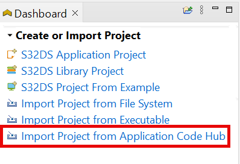
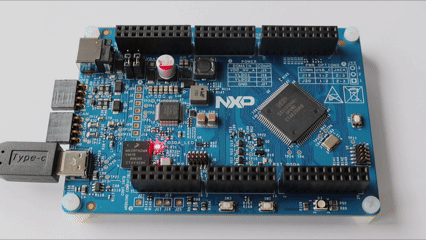

# NXP Application Code Hub

## Control LED brightness through eMIOS PWM function on S32K3 series using MCAL drivers.
This demo showcases how to configure the Enhanced Modular IO Subsystem (eMIOS) module to use it as a PWM specifically in OPWMB (Output Pulse Width Modulation Buffered) mode, using the RTD high-level drivers, commonly known as MCAL drivers.

OPWMB generates a simple output PWM signal, which will be used to change the brightness of the red LED (100% DC, intermediate, and then 0% DC). This will be repeated in a cycle for 10 loops.

#### Boards: FRDM-A-S32K312
#### Categories: Motor Control
#### Peripherals: eMIOS, PWM
#### Toolchains: S32 Design Studio IDE

## Table of Contents
1. [Software and Tools](#step1)
2. [Hardware](#step2)
3. [Setup](#step3)
4. [Results](#step4)
5. [Support](#step6)
6. [Release Notes](#step7)

## 1. Software and Tools
This example was developed using the FRDM Automotive Bundle for S32K3. To download and install the complete software and tools ecosystem, use the following link:
- [S32K3 FRDM Automotive Board Installation Package](https://www.nxp.com/app-autopackagemgr/automotive-software-package-manager:AUTO-SW-PACKAGE-MANAGER?currentTab=0&selectedDevices=S32K3&applicationVersionID=156)

## 2. Hardware

- Personal Computer
- USB Type-C cable
- [FRDM-A-S32K312](https://www.nxp.com/design/design-center/development-boards-and-designs/FRDM-A-S32K312)
[

](images/FRDM-A-S32K312.png)

## 3. Setup
### 3.1 Import the project to S32 Design Studio IDE

1. Open S32 Design Studio IDE, in the Dashboard Panel, choose **Import project from Application Code Hub**.
    [

](./images/import_project_1.png)

2. Find the demo you need by searching the name directly. Open the project, click the **GitHub link**, S32 Design Studio IDE will automatically retrieve project attributes then click **Next>**.
    [

](./images/import_project_2.png) 
    [

](./images/import_project_3.png) 

3. Select **main** branch and then click **Next>**.

4. Select your local path for the repo in **Destination->Directory:** window. The S32 Design Studio IDE will clone the repo into this path, click **Next>**.

5. Select **Import existing Eclipse projects** then click **Next>**.

6. Select the project in this repo (only one project in this repo) then click **Finish**.

### 3.2 Generating, building and running the example application
1. In Project Explorer, right-click the project and select **Update Code and Build Project**. This will generate the configuration (Pins, Clocks, Peripherals), update the source code and build the project using the active configuration (e.g. Debug_FLASH).
Make sure the build completes successfully and the *.elf file is generated without errors.
[
 ](./images/update_and_build.png)
Press **Yes** in the **SDK Component Management** pop-up window to continue.

2. Go to Debug and select Debug Configurations. There will be a debug configuration for this project:

        Configuration Name                  Description
        -------------------------------     -----------------------
        $(example)_debug_flash_pemicro      Debug the FLASH configuration using PEmicro probe

    Select the desired debug configuration and click on **Debug**. Now the perspective will change to the **Debug Perspective**.
    Use the controls to control the program flow.

## 4. Results
You should see the brightness of the red LED switch between 3 different states (100% DC, intermediate, and then 0% DC) 10 times. An example check file is included that is used to automatically test examples, this writes a pass or fail status in the memory at a certain address.
    [

](./images/Video_Project.gif)

## 5. Support
* [Enhanced Modular Input Output System (eMIOS)](https://docs.nxp.com/bundle/AN14792/page/topics/emios.html)

#### Project Metadata

<!----- Boards ----->

<!----- Categories ----->

<!----- Peripherals ----->

<!----- Toolchains ----->

Questions regarding the content/correctness of this example can be entered as Issues within this GitHub repository.

>**Warning**: For more general technical questions regarding NXP Microcontrollers and the difference in expected functionality, enter your questions on the [NXP Community Forum](https://community.nxp.com/)

## 6. Release Notes
| Version | Description / Update                           | Date                        |
|:-------:|------------------------------------------------|----------------------------:|
| 1.0     | Initial release on Application Code Hub        | October 13th 2025 |

