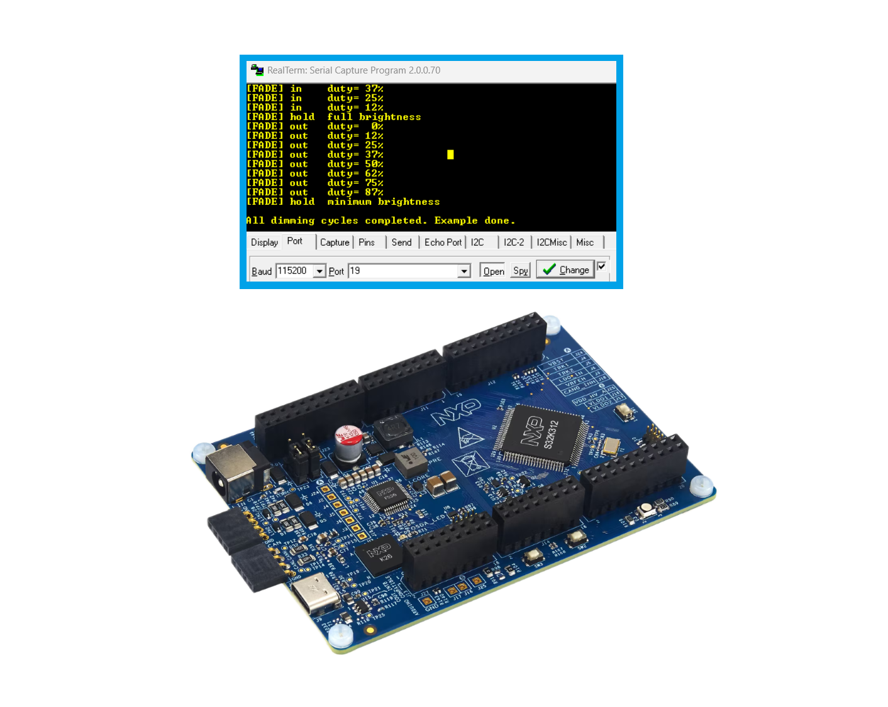
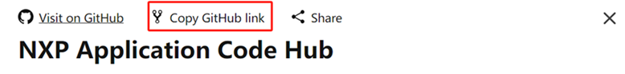
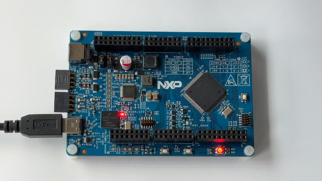

# NXP Application Code Hub
[](https://www.nxp.com)

## Control LED brightness through eMIOS PWM using MCAL drivers with UART
This demo showcases how to configure the Enhanced Modular I/O Subsystem (eMIOS) module to use it as a PWM specifically in OPWMB (Output Pulse Width Modulation Buffered) mode, using the RTD high-level drivers, commonly known as MCAL drivers.

OPWMB generates a simple output PWM signal, which will be used to change the brightness of the red LED (100% DC, intermediate, and then 0% DC). This will be repeated in a cycle for 10 loops.

The application also reports its progress over a serial console using the UART (LPUART) MCAL driver, so the dimming sequence can be followed on a terminal in addition to observing the LED.
[<p align="center"></p>](images/FRDM-A-S32K312-eMIOS-PWM-UART.png)

#### Boards: FRDM-A-S32K312
#### Categories: Low Power, Motor Control, User Interface
#### Peripherals: PWM, UART, eMIOS
#### Toolchains: S32 Design Studio IDE

## Table of Contents
1. [Software and Tools](#step1)
2. [Hardware](#step2)
3. [Setup](#step3)
4. [Results](#step4)
5. [Support](#step5)
6. [Release Notes](#step6)

## 1. Software and Tools<a name="step1"></a>
This example was developed using the FRDM Automotive Bundle for S32K3 + S32M27. To download and install the complete software and tools ecosystem, use the following link:
- [ FRDM Automotive S32K3 + S32M27 Board Installation Package](https://www.nxp.com/app-autopackagemgr/automotive-software-package-manager:AUTO-SW-PACKAGE-MANAGER?currentTab=0&selectedDevices=S32K3&applicationVersionID=203)

## 2. Hardware<a name="step2"></a>
### 2.1 Required Hardware
- Personal Computer
- USB Type-C cable
- [FRDM-A-S32K312](https://www.nxp.com/design/design-center/development-boards-and-designs/FRDM-A-S32K312)
[<p></p>](https://www.nxp.com/assets/images/en/dev-board-image/FRDM-A-S32K312-TOP.jpg)

### 2.2 Debugger Connection
- Connect the Type-C USB cable to PC and FRDM-A-S32K312 board for power supply and debugging

## 3. Setup<a name="step3"></a>

### 3.1 Import the Project into S32 Design Studio IDE
1. Open S32 Design Studio IDE. In the Dashboard Panel, choose **Import project from Application Code Hub**.
   [<p align="center"></p>](./images/import_project_1.png)

2. Find the demo by searching: [dm-control-led-emios-pwm-s32k312-mcal](https://mcuxpresso.nxp.com/appcodehub?search=dm-control-led-emios-pwm-s32k312-mcal)
3. Open the project, click the **GitHub link**, S32 Design Studio IDE will automatically retrieve project attributes, then click **Next>**.
    [<p align="center"></p>](./images/import_project_3.png)

4. Select **main** branch and then click **Next>**.

5. Select your local path for the repo in the **Destination->Directory:** window. The S32 Design Studio IDE will clone the repo into this path, click **Next>**.

6. Select **Import existing Eclipse projects** then click **Next>**.

7. Select the project in this repo (only one project in this repo) then click **Finish**.

### 3.2 Generating, Building and Running the Example
1. In Project Explorer, right-click the project and select **Update Code and Build Project**. This will generate the configuration (Pins, Clocks, Peripherals), update the source code and build the project using the active configuration (e.g. Debug_FLASH).
Make sure the build completes successfully and the *.elf file is generated without errors.
[<p align="center"></p>](./images/update_and_build.png)
Press **Yes** in the **SDK Component Management** pop-up window to continue.

1. Go to **Debug** and select **Debug Configurations**. There will be a debug configuration for this project:
[<p align="center"></p>](./images/Debug_config.png)

        Configuration Name                  Description
        -------------------------------     -----------------------
        $(example)_debug_flash_pemicro      Debug the FLASH configuration using PEmicro probe

    Select the desired debug configuration and click on **Debug**. Now the perspective will change to the **Debug Perspective**.
    Use the controls to control the program flow.

### 3.3 Opening the Serial Console
Open a serial terminal on the enumerated COM port (settings: 115200 baud, 8 data bits, no parity, 1 stop bit, no flow control) to see the status messages printed by the example.

### 3.4 Peripherals Used
The following resources are used by this example:

| Signal        | Location                             | Description                                              |
|---------------|--------------------------------------|----------------------------------------------------------|
| RED LED       | eMIOS_1 channel 12 (EMIOS_1_CH_12)   | PWM output used to dim the on-board red LED              |
| Counter bus   | eMIOS_1 channel 23 (EMIOS_1_CH_23)   | External counter bus providing the PWM period            |
| UART          | LPUART6, PTA16 (tx) / PTA15 (rx), 115200 8N1 | Serial console for status output                 |

No external wiring is required. The LPUART6 pins are routed to the on-board debugger's virtual COM port, so the same USB Type-C cable used for debugging also carries the serial console.

## 4. Results<a name="step4"></a>

The RED LED demonstrates a smooth breathing effect with gradual brightness transitions, repeating the sequence 10 times:

- **Fade IN**: The LED gradually increases in brightness from 0% to 100% duty cycle in smooth increments
- **Hold at Maximum**: The LED remains at full brightness (100% DC) for a brief period
- **Fade OUT**: The LED gradually decreases in brightness from 100% to 0% duty cycle in smooth increments  
- **Hold at Minimum**: The LED remains off (0% DC) for a brief period

The dimming effect is achieved by:
- Using eMIOS channel 1_CH_12 in OPWMB (Output Pulse Width Modulation Buffered) mode
- Setting the counter bus period to 0x9000 on eMIOS channel 1_CH_23
- Incrementally adjusting the duty cycle in steps of 0x100 (256 decimal)
- Adding delays of 50,000 iterations between each duty cycle change for smooth visual transitions
- Adding longer delays (10,000,000 iterations) at maximum and minimum brightness states

In parallel, the application reports its progress on the serial console using the UART (LPUART) MCAL driver. After a start-up banner, each breathing cycle prints its cycle number, the current duty cycle as an integer percentage while ramping, and a message at each hold state. The duty cycle reports are throttled (emitted every 16th step) so that the serial traffic does not visibly slow down the dimming ramp:

```text
 S32K312 eMIOS PWM LED dimming example
Running 10 dimming cycles on EMIOS_1_CH_12

[LED]  cycle 1/10
[FADE] in    duty=100%
[FADE] in    duty= 87%
...
[FADE] hold  full brightness
[FADE] out   duty=  0%
[FADE] out   duty= 12%
...
[FADE] hold  minimum brightness
```

After completing 10 breathing cycles, a completion message is printed, the PWM and UART drivers are de-initialized and the program enters an idle state.

[<p align="center"></p>](./images/Video_Project.gif)

An example check file is included that is used to automatically test examples, this writes a pass or fail status in memory at a specific memory address.


## 5. Support<a name="step5"></a>
* [Enhanced Modular Input Output System (eMIOS)](https://docs.nxp.com/bundle/AN14792/page/topics/emios.html)
* [Low Power Universal Asynchronous Receiver/Transmitter (LPUART)](https://docs.nxp.com/bundle/AN14792/page/topics/lpuart.html)

#### Project Metadata

<!----- Boards ----->
[](https://mcuxpresso.nxp.com/appcodehub?hwBoard=FRDM-A-S32K312)

<!----- Categories ----->
[](https://mcuxpresso.nxp.com/appcodehub?category=low_power)
[](https://mcuxpresso.nxp.com/appcodehub?category=motor_control)
[](https://mcuxpresso.nxp.com/appcodehub?category=ui)

<!----- Peripherals ----->
[](https://mcuxpresso.nxp.com/appcodehub?peripheral=pwm)
[](https://mcuxpresso.nxp.com/appcodehub?peripheral=uart)
[](https://mcuxpresso.nxp.com/appcodehub?peripheral=emios)

<!----- Toolchains ----->
[](https://mcuxpresso.nxp.com/appcodehub?toolchain=s32_design_studio_ide)

Questions regarding the content/correctness of this example can be entered as Issues within this GitHub repository.

>**Note**: For more general technical questions regarding NXP Microcontrollers and the difference in expected functionality, enter your questions on the [NXP Community Forum](https://community.nxp.com/)

[](https://www.youtube.com/NXP_Semiconductors)
[](https://www.linkedin.com/company/nxp-semiconductors)
[](https://www.facebook.com/nxpsemi/)
[](https://x.com/NXP)

## 6. Release Notes<a name="step6"></a>
| Version | Description / Update                           | Date                        |
|:-------:|------------------------------------------------|----------------------------:|
| 1.0     | Initial release on Application Code Hub        | October 13<sup>th</sup> 2025|
| 1.1     | Updated to FRDM Automotive S32K3 + S32M27 (RTD 7.0.1) and UART console | August 27<sup>th</sup> 2026 |
